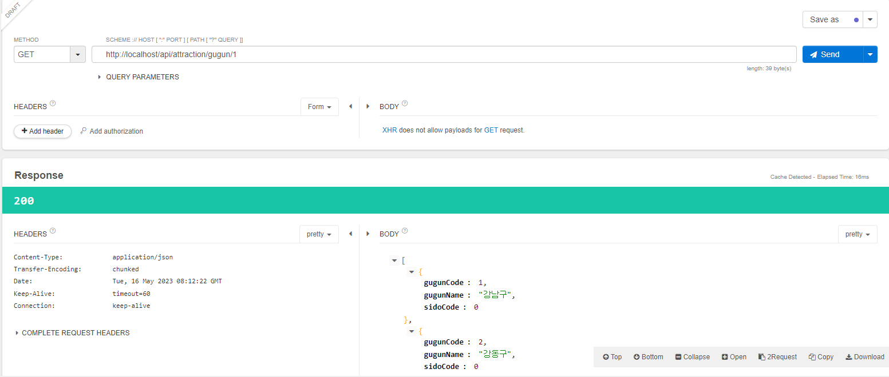

# 0516

### 마이페이지 vue

- 로그인 구현 전이라 local에 직접 데이터를 넣음

- DB 연결이 안되어 있어서 데이터를 직접 변경할순 없지만 틀을 잡음

- 요약

src/main.js -> line 6 : add import

src/api -> add folder
src/api/vueBootstrap.js -> add file
scr/api/http.js -> add file

bootstrap
bootstrap-vue
axios 설치

App.vue -> line 14 : add routerlink

store/index.js -> add state, mutations, actions
import http

### Controller 수정

마이페이지에서 사용할 시도 구군 정보를 얻어오기 위한 controller 수정

| url | 메소드 | 요청값 | 역할 | 결과 |
| --- | --- | --- | --- | --- |
| /api/attraction/sido | GET |  | sido 리스트 조회 | 성공 |
| /api/attraction/gugun/1 | GET | {sidoCode} | gugun 리스트 조회 | 성공 |

### Talend를 이용해 성공 여부 확인

- sido 정보 가져오기 - 성공

- sido 정보에 따른 gugun 정보 가져오기 - 성공

