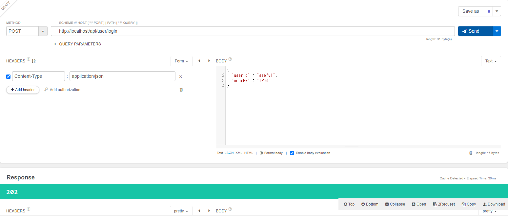

# 0517

### 목표

마이페이지 vue 완성

로그인 기능 구현

### UserController

- 기존 Session을 사용하여 로그인 구현한 것을 JWT 토큰으로 변경

| url | 메소드 | 요청값 | 역할 | 결과 |
| --- | --- | --- | --- | --- |
| /api/user/login | POST | {userId : userId, userPw, userPw} | 로그인 | 성공 |
| /api/user/logout/{userId} | GET | {userId} | 로그아웃 | 성공 |
| /api/user/info/{userId} | GET | {userId} | 사용자 정보 가져오기 | 성공 |
| /api/user/checkDuplicateId/{userId} | GET | {userId} | 중복아이디 검사 | 성공 |
| /api/user/signup | POST |  | 회원 가입 | 성공 |
| /api/user/findPw | POST |  | 비밀번호 찾기 | 성공 |

- 로그인 성공

- 로그아웃 성공

- 사용자 아이디를 통해 사용자 정보 가져오기

- 기존 token 갱신

- 중복체크 구현

- 회원 가입

- 비밀번호 찾기

### JWT Service

| 함수명 | parameter | return | 기능 |
| --- | --- | --- | --- |
| create | String key, String userId, String subject, long expire | String | 토큰 생성 |
| createAccessToken | String key, String userId | String | create를 통해 access-token 생성 |
| createRefreshToken | String key, String userId | String | create를 통해 refresh-token 생성 |
| generateKey |  | byte[] | 키를 인코딩하는 역할 |
| checkToken | String jwt | boolean | 토큰 일치하는지 확인 |