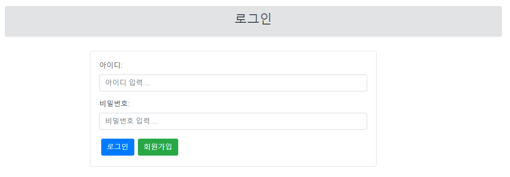

# 0518

## Vue

### 로그인 구현

token을 이용한 로그인 구현

vue에서 입력 받은 정보를 server에 전달하여 token 생성 후 DB에 token 저장



### 회원가입 구현

입력 폼을 가지고 원하는 정보를 받아 server에 전달

필수 입력 사항 및 글자 수 제한 등 제약 사항 추가


- 회원가입의 제약 조건은 필수 입력 : 아이디, 비밀번호, 이름

- 현재 문제점
  - 하지만 server 통신 후 정상적으로 DB에 들어가지만 실패라고 뜸
    ```jsx
    async userSignup({commit}, user) {
          await signup (
            user,
            ({data}) => {
              if (data.message === 'success') {
                commit('SET_IS_SIGNUP', true);
              }
            },
            (error) => {
              console.log(error);
              alert("회원가입에 실패");
              throw new Error("실패띠")
            })
        }
    ```
    서버에서 반환하는 데이터 타입을 void에서 ResponseEntity로 변경
    ResponseEntity에 성공, 실패 메시지 담아서 반환
    성공 실패 여부에 따라 state에 있는 데이터 변경
    내일 목표 :
    store에 있는 state에 있는 isSignUp에 따라 동작하도록 변경해야함
  - 필수 입력을 다 입력 안해도 성공적으로 DB에 들어감 → 해결
    ```jsx
    user: {
            userId: null,
            userPw: null,
            userName: null,
            email: '',
            sido: 0,
            gugun: 0,
            birthYear: 0,
            birthMonth: '',
            birthDate: '',
          },
    ```
    원래 null이 아니라 ‘’로 초기 설정을 해놔서 빈 문자열일 들어가고 있었음
