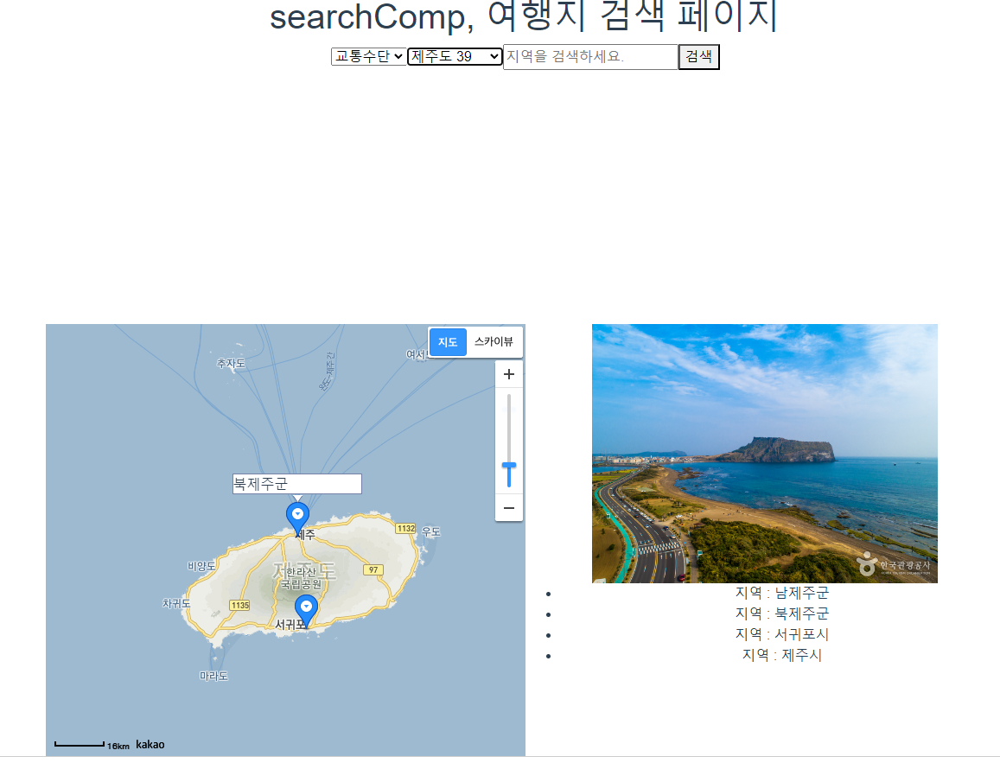

# 프로젝트

Date: 2023년 5월 19일
이번주: Yes
즐겨찾기: No

1. 마커가 제대로 찍히지 않음

→ 마커 비동기 처리 문제 : 마커값들을 배열로 저장하고, 마지막에 배열 크기만큼 마커를 생성하여 동기 처리 가능하게 변경

동기/ 비동기 처리 최종 정리 및 Map 생성 시 변수에 따라 설정하게 변경

```jsx
async loadMaker() {
      const markerPositions = []; // 좌표를 저장할 배열

      const getAddressSearch = (gugunName) => {
        return new Promise((resolve, reject) => {
          const geocoder = new kakao.maps.services.Geocoder();
          geocoder.addressSearch(
            this.sidoName + " " + gugunName,
            (result, status) => {
              if (status === kakao.maps.services.Status.OK) {
                const coords = new kakao.maps.LatLng(result[0].y, result[0].x);
                const mLat = coords.getLat();
                const mLan = coords.getLng();
                const markerPosition = new kakao.maps.LatLng(mLat, mLan);
                resolve(markerPosition); // 성공적으로 좌표를 얻으면 resolve 호출
              } else {
                reject(status); // 좌표를 얻지 못하면 reject 호출
              }
            }
          );
        });
      };

      try {
        // 주소 검색 비동기 처리 및 markerPositions 배열에 추가
        await Promise.all(
          this.gugunList.map(async (gugun) => {
            try {
              const markerPosition = await getAddressSearch(gugun.gugunName);
              markerPositions.push(markerPosition);
            } catch (error) {
              console.error("Error occurred during addressSearch:", error);
            }
          })
        );

        // 모든 마커가 추가된 후에 추가 로직 실행
        markerPositions.forEach((markerPosition) => {
          const marker = new kakao.maps.Marker({
            position: markerPosition,
          });
          marker.setMap(this.map);
          this.markers.push(marker);
        });

        console.log(markerPositions);
        console.log(markerPositions.length);
      } catch (error) {
        console.error("Error occurred:", error);
      }
    },
```

1. 마커에 마우스 올리면 정보 출력 가능하게 변경 및 클릭 시 해당 result로 이동 가능하게 변경

광주시의 경우 에러 발생(중복 문제.)



1. 마커 클릭 시 해당 정보를 가지고 vuex에 저장.

async - await를 통해 getGugunUseName으로 정보를 먼저 저장하고, 이후 다시 라우터 뷰에서 지도를 출력하게 변경.

해당 값을 토대로 선택한 위치의 지도 정보를 가져온다.

```jsx
watch 옵션 추가

//기존 정보로 클릭해도 찾을 수 있게
async gugunClick(gugun) {
      await this.SET_GUGUN({
        gugunCode: gugun.gugunCode,
        sidoCode: this.sidoCode,
        gugunName: gugun.gugunName,
      });
      this.$router.push("/srView1"); // 다른 뷰로 이동
    },
```

1. 지도 객체 고정

좌표 및 지도 변수(lan, lat)를 vuex 사용하여 전역변수화 시키고 load 시 해당 변수 이용하여 생성하게 구조 변경

1. 하위 라우터 정돈, 분류별 추가

01 ~ 10번까지 세부 내역 추가

1. 01-해당 관광지 정보 가져오기 (컨트롤러 변경)

사용할 수 있는 값은 sidoCode, gugunCode, content_type_id(12)이다. 이 값으로 해당 지역에 맞는 관광지를 리스트로 받아 가져온다.

```jsx
// 관광지 상세 정보 보기
		@GetMapping("view/{contentId}/{sidoCode}/{gugunCode}")
		public AttractionInfo getAttractionInfo(@PathVariable("contentId") int contentId, @PathVariable("sidoCode") int sidoCode, @PathVariable("gugunCode") int gugunCode) throws Exception {
			return attractionService.searchAtt(contentId, sidoCode, gugunCode);
		}

```

가져오기 완료.

이 데이터를 저장할 값을 attInfo[] 배열로 vuex에 저장하겠다.


<추가로 필요한 것>

각 종류(관광지, 축제)별 특정 마커 표시

- 이에 맞게 교통수단에 따른 마커 추천

카카오맵 우클릭으로 여행 계획 추가 가능하게 했으면 좋겠음.
