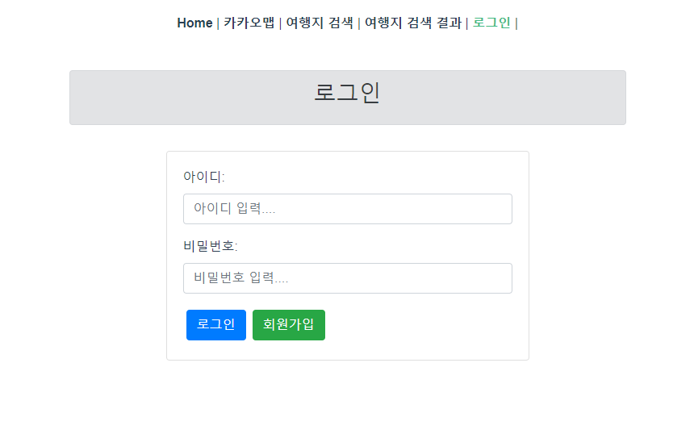

# 0519

### 목표

1. 마이페이지에서 로그인한 사용자의 정보 가져오기
2. 게시판 기초 만들기

### 해야 할 일

변경된 DB export하기

### DB 변경 사항

user table에서 birthYear, birthMonth, birthDate을 모두 int형으로 변경

### Login

- 로그인 화면



- 로그인 실패


- 로그인 성공
    - 로그인 성공 시 로그인 버튼 사라지고 마이페이지와 로그아웃 생성
    - 로그인 후 Home으로 이동
    - 로그인할 때 userId와 userNo를 token에 넣기
    - Controller 코드
    
    ```java
    public ResponseEntity<Map<String, Object>> login(@RequestBody  User user) {
    		Map<String, Object> resultMap = new HashMap<>();
    		HttpStatus status = null;
    		try {
    			User loginUser = userService.getUser(user);
    			if (loginUser != null) {
    				String accessToken = jwtService.createAccessToken("userId", loginUser.getUserId(), loginUser.getUserNo());// key, data
    				String refreshToken = jwtService.createRefreshToken("userId", loginUser.getUserId(), loginUser.getUserNo());// key, data
    				resultMap.put("access-token", accessToken);
    				resultMap.put("refresh-token", refreshToken);
    				resultMap.put("message", SUCCESS);
    				status = HttpStatus.ACCEPTED;
    			} else {
    				resultMap.put("message", FAIL);
    				status = HttpStatus.ACCEPTED;
    			}
    		} catch (Exception e) {
    			resultMap.put("message", e.getMessage());
    			status = HttpStatus.INTERNAL_SERVER_ERROR;
    		}
    		return new ResponseEntity<Map<String, Object>>(resultMap, status);
    	}
    ```
    
    - jwt Token service 코드
    
    ```java
    private String create(String key, String userId, int userNo, String subject, long expire) {
    		Claims claims = Jwts.claims()
    				// 토큰 제목 설정 ex) access-token, refresh-token
    				.setSubject(subject)
    				// 생성일 설정
    				.setIssuedAt(new Date())
    				// 만료일 설정 (유효기간)
    				.setExpiration(new Date(System.currentTimeMillis() + expire));
    
    		// 저장할 data의 key, value
    		claims.put(key, userId);
    		claims.put("userNo", userNo);
    
    		String jwt = Jwts.builder()
    				// Header 설정 : 토큰의 타입, 해쉬 알고리즘 정보 세팅.
    				.setHeaderParam("typ", "JWT").setClaims(claims)
    				// Signature 설정 : secret key를 활용한 암호화.
    				.signWith(SignatureAlgorithm.HS256, this.generateKey()).compact(); // 직렬화 처리.
    
    		return jwt;
    	}
    ```
    


- 로그아웃
    - 로그인 전 sesson storage에 token이 존재
    
    
    
    - 로그아웃 후 token 삭제
    
    
    

### My Page

해야할 일
  1. 정보를 받아올 때 시도 코드가 아니라 지역 이름이 나오도록
  
  2. 생년월일을 받아올 때 YYYY-MM-DD 형식으로 받아오기

  3. 생년월일을 수정하면 YYYY-MM-DD 형식으로 저장

- 로그인 한 유저의 정보 가져오기
    - token에 넣어둔 userId와 userNo를 decode해서 추출

- Controller 코드

```java
@GetMapping("/")
	public User getUser(HttpServletRequest request) throws Exception {
		// request에 있는 token에서 userId 추출하기
		return jwtService.getUserInfo(request);
	}
```

- jwt Token service 코드

```java
@Override
	public User getUserInfo(HttpServletRequest request) throws Exception {
		String accessToken = request.getHeader("access-token");
		Map<String, Object> map = get(accessToken);
		String userId = (String) map.get("userId");
		return userService.getUserById(userId);
	}
```


