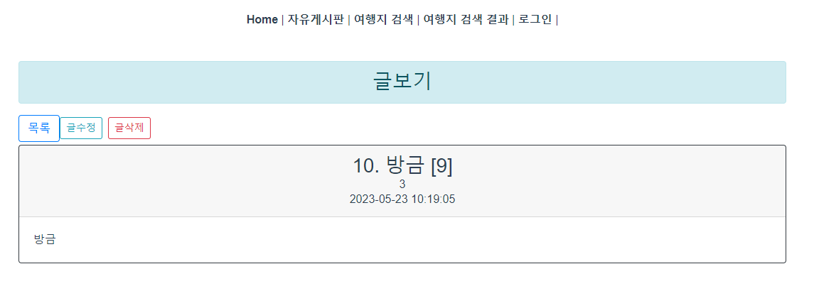
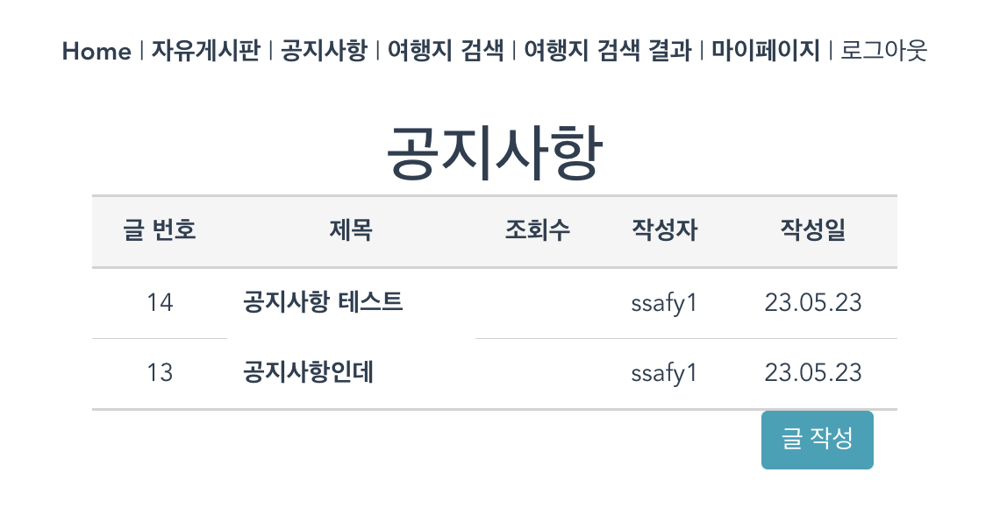
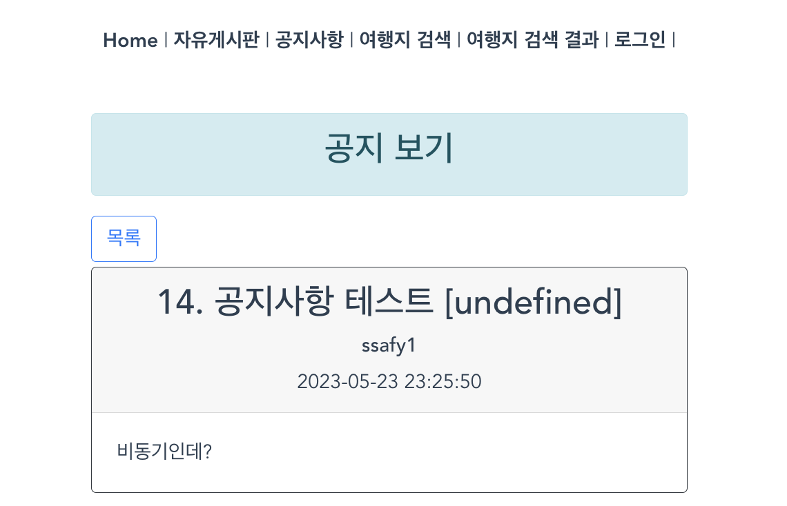
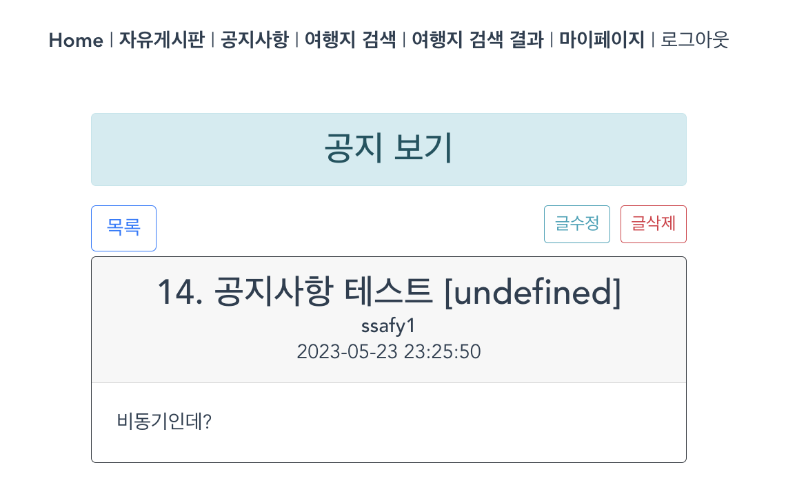
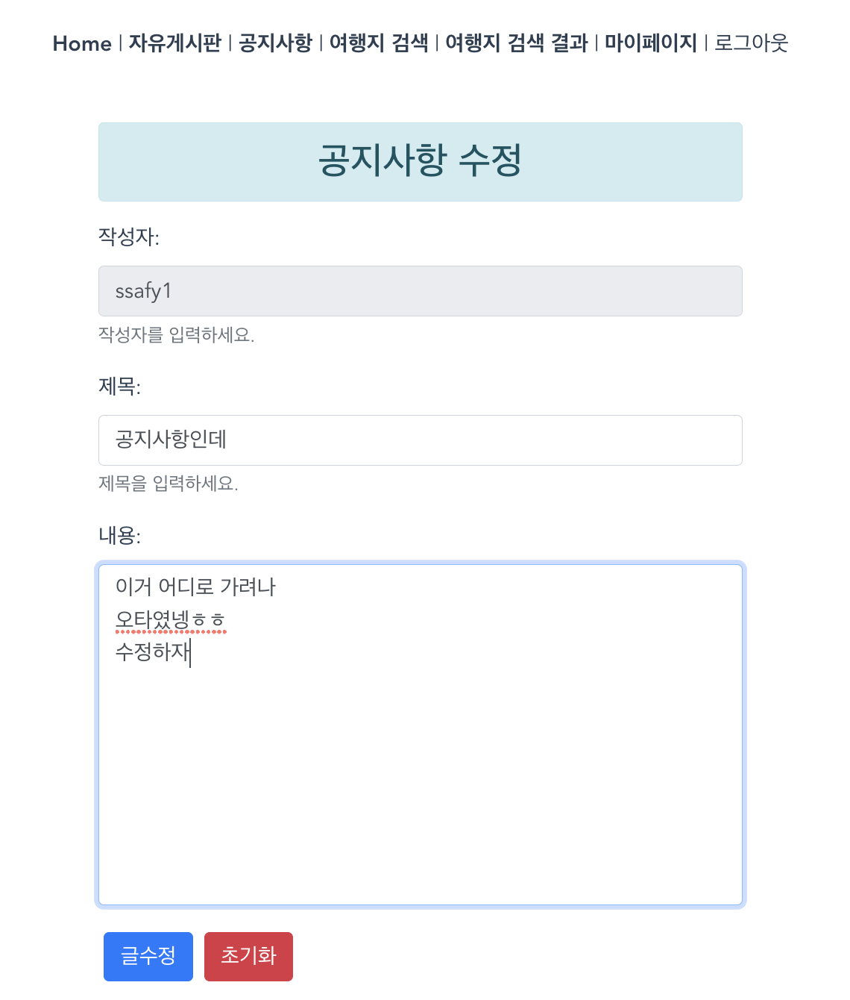
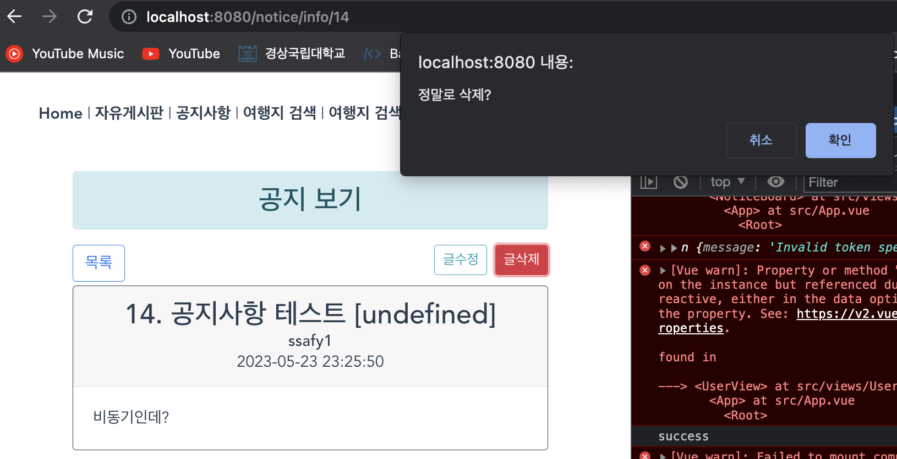

# 0523

### 해야 할 일

1. 목록에서 상세 페이지로 이동
2. 글 목록에 들어가면 조회수 증가도 바로 바로 되도록
3. 글 삭제하면 바로 반영되도록
4. 글 작성 입력 받도록 → 구현

### 목록에서 상세 페이지로 이동

router 설정으로 구현

글 목록으로 이동하면서 조회수 1 바로 증가



### 글 삭제하면 바로 반영되도록

→ async await를 사용하여 구현

await는 axios 함수에만 붙일 수 있음

```jsx
async deleteBoard() {
  // 글 삭제 후 목록 리스트로 이동
  if (confirm("정말로 삭제?")) {
    await this.deleteStoryBoard(this.board.storyBoardNo)
    this.moveList();
  }
},
```


### 글 작성

session Storage에 있는 token에서 userId를 decode해서 가져올 수 있음

```jsx
let user = jwt_decode(sessionStorage.getItem("access-token"));
this.board.userId = user.userId;
```


### 글 목록 최신이 가장 위로 오도록 변경

정렬 순서 변경 및 작성자를 userId로 조회되도록 변경


### 공지사항 CRUD

공지사항 목록



### 공지사항 보기



### 작성자의 글에는 수정. 삭제 버튼 생성



### 공지사항 수정



### 공지사항 삭제


