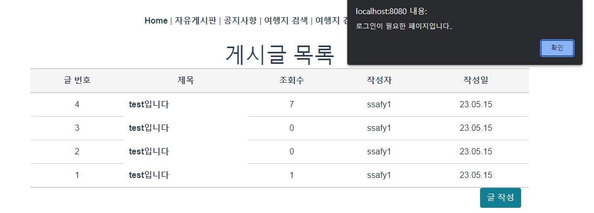

# 0524

### 해야 할 일

1. 공지사항 삭제, 등록 → 비동기 처리 수정하기
2. 로그인한 사용자들만 특정 페이지에 접근할 수 있도록 권한 부여
3. 관리자만 따로 할 수 있는 기능을 위해 token 수정
4. 댓글 기능 CRUD 구현
5. 메인페이지 스와이프 만들기

### 공지사항 삭제, 등록 비동기 처리

watch를 사용하여 noticeStore에 저장되어 있는 notices의 변화를 관찰

```jsx
computed: {
    ...mapState(noticeStore, ["notices"]),
  },
  watch: {
    notices(){
      this.noticeList = this.notices;
    }
```

### 로그인 한 사용자만 접근할 수 있도록

store에 있는 userInfo와 checkToken을 확인해서 로그인 되어 있는 사용자만 접근할 수 있도록 구현

→ 로그인 페이지로 이동 → 로그인하면 메인 페이지로 이동

```jsx
const onlyAuthUser = async (to, from, next) => {
  const checkUserInfo = store.getters['userStore/checkUserInfo'];
  const checkToken = store.getters['userStore/checkToken'];
  let token = sessionStorage.getItem('access-token');
  console.log('로그인 처리 전', checkUserInfo, token);

  if (checkUserInfo != null && token) {
    console.log('토큰 유효성 체크하러 가자!!!!');
    await store.dispatch('userStore/getUserInfo', token);
  }
  if (!checkToken || checkUserInfo === null) {
    alert('로그인이 필요한 페이지입니다..');
    router.push({ name: 'login' });
  } else {
    console.log('로그인 했다!!!!!!!!!!!!!.');
    next();
  }
};
```



### 관리자 확인 여부를 위한 token 수정

```java
private String create(User user, String subject, long expire) {
		Claims claims = Jwts.claims()
				// 토큰 제목 설정 ex) access-token, refresh-token
				.setSubject(subject)
				// 생성일 설정
				.setIssuedAt(new Date())
				// 만료일 설정 (유효기간)
				.setExpiration(new Date(System.currentTimeMillis() + expire));

		// 저장할 data의 key, value
		claims.put("userId", user.getUserId());
		claims.put("userNo", user.getUserNo());
		claims.put("isAdmin", user.getIsAdmin());

		String jwt = Jwts.builder()
				// Header 설정 : 토큰의 타입, 해쉬 알고리즘 정보 세팅.
				.setHeaderParam("typ", "JWT").setClaims(claims)
				// Signature 설정 : secret key를 활용한 암호화.
				.signWith(SignatureAlgorithm.HS256, this.generateKey()).compact(); // 직렬화 처리.

		return jwt;
	}
```

- 일반 사용자일 경우


- 관리자일 경우 → 글 작성 버튼이 생성
  - 작성 후 수정, 삭제는 게시판과 동일하게 작동


### CSS

NavBar 변경

- 로그인 안한 경우 로그인 버튼이 있음


- 로그인 한 경우 유저의 아이디를 우측 상단에 보여줌


