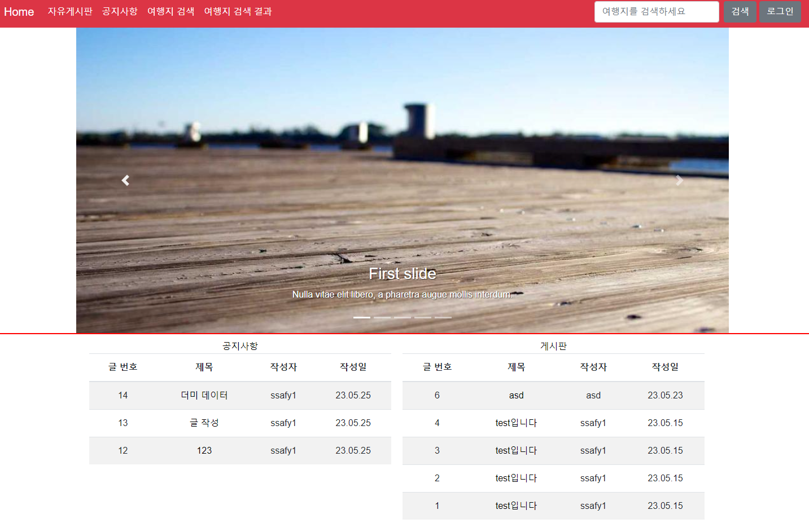

# 0525

### 오늘 할 일

1. 메인 화면 CSS 및 메인 화면에 공지사항, 게시판 요약 리스트 보여주기
2. 회원 가입 시 아이디 중복 검사 로직 구현
3. 자료 준비
4. 시연 영상
5. CSS 마저 하기

### 메인 화면

- 메인 화면 밑에 2분할 하여 각각 공지사항과 게시판 보여줌

### 회원 가입 중복 검사

- 필수 입력 정보를 안넣으면 빨간 글씨로 알려줌

- 중복 검사를 안하면 빨간 글씨로 역시 알려줌

- 중복 검사 성공적으로 실행 후 DB에 담겨있음을 확인

